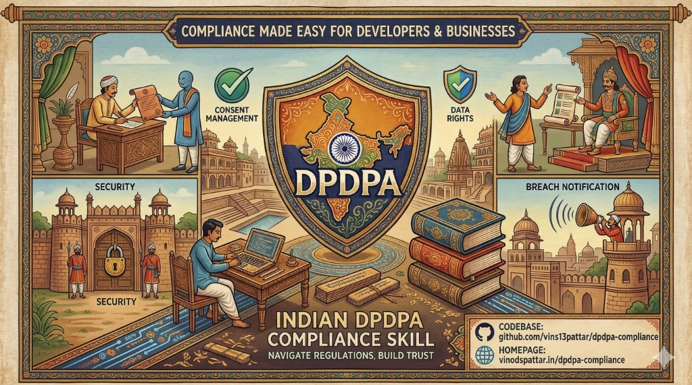

# DPDPA Compliance Agent Skill

[](https://skills.sh/vins13pattar/dpdpa-compliance/dpdpa-compliance)
[](https://opensource.org/licenses/MIT)
[](https://agentskills.io/)



An [Agent Skill](https://agentskills.io/) that helps coding agents audit, implement, and
remediate compliance with India's **Digital Personal Data Protection Act, 2023 (DPDPA)**.

Works with **Claude Code**, **Cursor**, **Codex**, **OpenCode**, **Copilot**, and
[37+ other coding agents](https://github.com/vercel-labs/skills#supported-agents).

## What It Does

| Mode | Description |
|------|-------------|
| **Audit** | Systematically scan your codebase against a 52-point DPDPA checklist. Get findings with severity, DPDPA section references, and concrete code fixes. |
| **Implement** | Generate production-ready DPDPA-compliant code — consent management, data export, account deletion, breach notification, children's data protection, and more. |
| **Guidance** | Get actionable recommendations for organizational obligations that go beyond code — DPO appointment, DPIA processes, breach response playbooks, data processor agreements. |

## Install

```bash
npx skills add vins13pattar/dpdpa-compliance
```

Or install to a specific agent:

```bash
npx skills add vins13pattar/dpdpa-compliance -a claude-code
npx skills add vins13pattar/dpdpa-compliance -a cursor
```

## Usage

Once installed, your coding agent will automatically activate this skill when you mention
DPDPA compliance, Indian data protection, consent management, data deletion, breach
notification, or related topics.

**Example prompts:**

```
Audit my app for DPDPA compliance
```

```
Implement a consent management system that complies with Indian data protection law
```

```
Add an account deletion flow that meets DPDPA requirements
```

```
What organizational steps do I need for DPDPA compliance beyond code?
```

```
Check if my analytics setup violates DPDPA
```

```
Add children's data protection to my React Native app
```

## What's Inside

```
skills/dpdpa-compliance/
├── SKILL.md                              # Main skill — agent instructions
├── scripts/
│   └── audit-scan.sh                     # Automated codebase scanner
└── references/
    ├── audit-checklist.md                # 52-point audit checklist
    ├── implementation-patterns.md        # Code patterns (Node, Python, Laravel, React, React Native)
    ├── organizational-guidelines.md      # Non-code obligations and templates
    └── dpdpa-full-text.md                # Complete Act text for reference
```

## DPDPA Coverage

This skill covers all major obligations under the Act:

- **Consent management** (Sections 3, 4, 5) — collection, recording, withdrawal, Consent Manager integration
- **Data Fiduciary obligations** (Section 7) — accuracy, security, breach notification, retention, DPO
- **Children's data** (Section 8) — age verification, parental consent, tracking restrictions
- **Significant Data Fiduciary** (Section 10) — DPO, DPIA, audits
- **Data Principal rights** (Sections 11-14) — access, correction, erasure, grievance, nomination
- **Cross-border transfer** (Section 16) — data flow mapping, transfer controls
- **Penalties** (Section 21) — risk assessment with penalty exposure (up to Rs. 250 crore)

## Framework Support

Implementation patterns are provided for:

- **Node.js / Express** — middleware, APIs, database schemas
- **Python / Django** — middleware, decorators, models
- **PHP / Laravel** — middleware, routes
- **React** — consent components, privacy settings
- **React Native / Expo** — mobile consent flows
- **SQL** — PostgreSQL/MySQL schemas for consent, auditing, retention

## Important Disclaimer

This skill provides **technical compliance guidance**, not legal advice. DPDPA rules from the
Central Government are still being notified. Always consult qualified legal counsel for
definitive compliance opinions.

## Contributing

Contributions are welcome! Key areas:

- Additional framework patterns (Go, Ruby on Rails, Spring Boot)
- Updates when DPDPA rules are published by MeitY
- Improvements to the audit scanner
- Translations of consent templates

## License

MIT