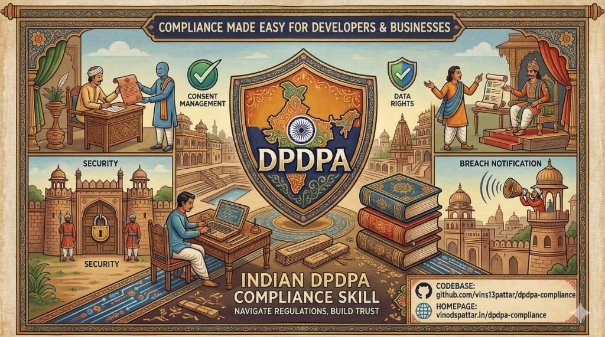

# DPDPA Compliance Agent Skill

[](https://github.com/vins13pattar/dpdpa-compliance/actions/workflows/ci.yml)
[](https://skills.sh/vins13pattar/dpdpa-compliance/dpdpa-compliance)
[](https://opensource.org/licenses/MIT)
[](https://agentskills.io/)



An open-source [Agent Skill](https://agentskills.io/) **and standalone CLI** that
helps you audit, implement, and remediate compliance with India's **Digital
Personal Data Protection Act, 2023 (DPDPA)** and the **DPDP Rules, 2025**.

> **⏰ The clock is running.** The DPDP Rules 2025 were notified on 13 November
> 2025. Consent Manager registration opens **~13 November 2026**, and the core
> obligations — consent, notice, breach notification, children's data, retention,
> Data Principal rights — become enforceable on **13 May 2027**, with penalties
> up to **₹250 crore** per breach category. Audit your codebase before the deadline.

## Two Ways to Use It

### 1. As an Agent Skill (Claude Code, Cursor, Codex, Copilot, and [37+ agents](https://github.com/vercel-labs/skills#supported-agents))

```bash
npx skills add vins13pattar/dpdpa-compliance
```

Your coding agent then audits against a 52-point checklist, generates compliant
code for your stack, and explains the organizational obligations code can't solve.

### 2. As a Standalone CLI (no AI agent required)

Python (PyPI):

```bash
pipx install dpdpa-audit          # or: pip install dpdpa-audit / uvx dpdpa-audit
dpdpa-audit ./my-app -o report.md
```

Node:

```bash
npx github:vins13pattar/dpdpa-compliance            # scan the current directory
npx github:vins13pattar/dpdpa-compliance . --fail-on high   # CI gate
```

Both run the same 52-check scanner and write a Markdown report with findings
mapped to DPDPA sections, severity ratings, and remediation guidance.
`--fail-on critical|high|medium|low` makes it a CI quality gate. Requires bash
(Linux, macOS, WSL, Git Bash).

## What It Does

| Mode | Description |
|------|-------------|
| **Audit** | Systematically scan your codebase against a 52-point DPDPA checklist. Get findings with severity, DPDPA section references, and concrete code fixes. |
| **Implement** | Generate production-ready DPDPA-compliant code — consent management, data export, account deletion, breach notification, children's data protection, Consent Manager integration, and more. |
| **Guidance** | Get actionable recommendations for organizational obligations that go beyond code — DPO appointment, DPIA processes, breach response playbooks, data processor agreements. |

**Example prompts** (agent skill):

```
Audit my app for DPDPA compliance
```

```
Implement a consent management system that complies with Indian data protection law
```

```
Add an account deletion flow that meets DPDPA requirements
```

```
What organizational steps do I need for DPDPA compliance beyond code?
```

## What's Inside

```
skills/dpdpa-compliance/
├── SKILL.md                                    # Main skill — agent instructions
├── scripts/
│   └── audit-scan.sh                           # Automated codebase scanner (52 checks)
└── references/
    ├── audit-checklist.md                      # 52-point audit checklist
    ├── implementation-patterns.md              # Node, Python, Laravel, React, RN, SQL,
    │                                           #   Consent Manager integration
    ├── implementation-patterns-go-rails-spring.md  # Go, Rails, Spring Boot
    ├── organizational-guidelines.md            # Non-code obligations and templates
    └── dpdpa-full-text.md                      # Act + DPDP Rules 2025 full text
cli/                                            # npx dpdpa-audit wrapper (Node)
python/                                         # dpdpa-audit PyPI package
tests/                                          # Fixture apps + scanner test suite
```

## DPDPA Coverage

This skill covers all major obligations under the Act and the DPDP Rules 2025:

- **Consent management** (Sections 4-6, Rule 3) — collection, recording, withdrawal, granularity
- **Consent Managers** (Section 6(7)-(9), Rule 4) — provider-agnostic integration pattern, ready for Board-registered providers from Nov 2026
- **Data Fiduciary obligations** (Section 8, Rules 6-9) — security safeguards, 72-hour breach notification, retention, 48-hour pre-erasure notice, DPO contact
- **Children's data** (Section 9, Rules 10-12) — age verification, verifiable parental consent, tracking restrictions
- **Significant Data Fiduciary** (Section 10, Rule 13) — DPO, annual DPIA and audit, algorithmic risk assessment
- **Data Principal rights** (Sections 11-14, Rule 14) — access, correction, erasure, 90-day grievance SLA, nomination
- **Cross-border transfer** (Section 16, Rule 15) — data flow mapping, transfer controls
- **Penalties** (Section 33, the Schedule) — risk assessment with penalty exposure up to ₹250 crore

## Framework Support

Implementation patterns are provided for:

- **Node.js / Express** — middleware, APIs, database schemas
- **Python / Django** — middleware, decorators, models
- **PHP / Laravel** — middleware, routes
- **Go** — net/http middleware, consent ledger, breach worker
- **Ruby on Rails** — concerns, controllers, migrations, jobs
- **Java / Spring Boot** — AOP consent guard, JPA entities, scheduled retention
- **React** — consent components, privacy settings
- **React Native / Expo** — mobile consent flows
- **SQL** — PostgreSQL/MySQL schemas for consent, auditing, retention

## Verifiability

For a legal-adjacent tool, trust is everything:

- **Tested scanner** — known-vulnerable and known-compliant fixture apps with 55
  assertions run in CI on every change ([tests/](tests/))
- **Regulatory stamp** — `SKILL.md` carries a "last verified" date against the
  notified Rules; [CHANGELOG.md](CHANGELOG.md) ties releases to MeitY notifications
- **Citations everywhere** — every check and pattern names the section or rule
  it implements, so you can verify against the [full text](skills/dpdpa-compliance/references/dpdpa-full-text.md)

## Important Disclaimer

This project provides **technical compliance guidance**, not legal advice.
Always consult qualified legal counsel for definitive compliance opinions.

## Contributing

See [CONTRIBUTING.md](CONTRIBUTING.md). Good places to start:

- Framework patterns: Flutter, Next.js, FastAPI ([good first issues](https://github.com/vins13pattar/dpdpa-compliance/issues?q=is%3Aissue+is%3Aopen+label%3A%22good+first+issue%22))
- Consent notice translations into Eighth Schedule languages
- New scanner checks (with fixture tests)
- Updates when MeitY notifies amendments or registers Consent Managers

## License

MIT
